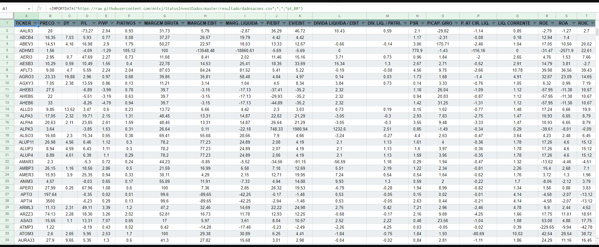

# StatusInvest - Dados
Informações das Ações e dos FII's listados na StatusInvest atualizadas a cada 0.02 minutos rodando em um [Raspberry Pi 4 Model B](https://www.raspberrypi.com/) que estava parado.

Atualização automática em: 0.02 minutos. <br>
<br>Última atualização: 18/07/2023 ás 18:40:01.  <br>


>Resultados: <br>
[Ações - Googlesheet](https://docs.google.com/spreadsheets/d/e/2PACX-1vS97G13-9owVwSm1y_TAE3gTaxYflhMvgXCYgj3zEGVwqrbPiUrsOyUUcdhM5D7YVJPNaiinn51Plgc/pubhtml?gid=313887204&single=true) <br>
[Ações - .csv](https://raw.githubusercontent.com/Antxj/StatusInvestDados/master/csv/dadosacoes.csv) <br>
[FII's - Googlesheet](https://docs.google.com/spreadsheets/d/e/2PACX-1vS97G13-9owVwSm1y_TAE3gTaxYflhMvgXCYgj3zEGVwqrbPiUrsOyUUcdhM5D7YVJPNaiinn51Plgc/pubhtml?gid=1741348998&single=true) <br>
[FII's - .csv](https://raw.githubusercontent.com/Antxj/StatusInvestDados/master/csv/dadosfiis.csv) <br>


Exemplo de uso no Googlesheets:
```sh
=IMPORTDATA("https://raw.githubusercontent.com/Antxj/StatusInvestDados/master/csv/dadosacoes.csv";";";"pt_BR")
```



